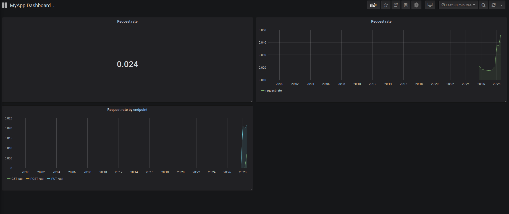

## prometheus-playground
This repository contains a docker environment that can be used to play with go/prometheus/grafana.

The environment is made of 3 containers:
- api: golang web application, reachable at http://localhost:8089 (the 2 available endpoints are `/api` and `/metrics`)
- prometheus, available at http://localhost:9090
- grafana, available at http://localhost:3000

To begin using the playground run `docker-compose up -d`, then open the grafana interface, 
use the the default credentials (`admin/admin`) to login and add prometheus as a data source: http://prometheus:9090.

At this point you can begin hitting the api at `http://localhost:8089/api`, this way the 
golang web application will expose the metrics via `/metrics`, the prometheus collector will run and collect them
every 5s and the data will be available in grafana.

If you want to import a basic dashboard I created you can check the json model in the `/resources/grafana` folder.

This is how the dashboard will look like:

--------

##### Note
If you want to play with the prometheus configuration, you can find the config file in `resources/prometheus/`.

Just make sure to restart the container after you make some changes.